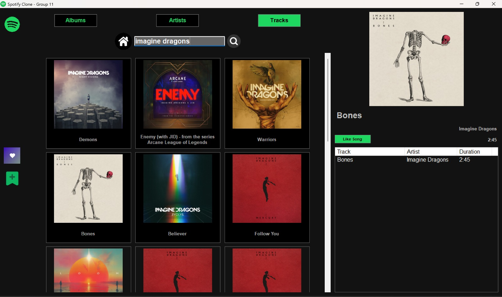

# 🎵 Spotify Clone - Desktop Music Browser

A Windows Forms desktop application that interfaces with the Spotify Web API to browse albums, artists, and tracks with a modern, Spotify-inspired UI.

Explore Albums:


Explore Tracks:



## 📋 Overview

This project is a Spotify Clone built as a desktop application using C# and Windows Forms. It allows users to search and browse Spotify's music catalog, view album details, and explore artist information - all within a sleek, dark-themed interface that mirrors Spotify's aesthetic.

**Note:** This is a browse-only application. Audio playback functionality is not implemented in the current version.

## ✨ Features

### 🔍 Search Functionality
- **Three Search Modes:**
  - **Albums:** Search for albums and view their track listings
  - **Artists:** Search for artists and view their top tracks
  - **Tracks:** Search for individual songs

### 📱 User Interface
- **Tab-Based Navigation:** Switch between Albums, Artists, and Tracks search modes
- **Grid Layout:** Album/Artist cards displayed in a responsive flow layout
- **Detail Panel:** Right-side panel shows detailed information when an item is selected
- **Hover Effects:** Interactive card highlighting on mouse hover
- **Dark Theme:** Modern Spotify-inspired color scheme (black background with Spotify green accents)

### 📀 Album View
When you click on an album card:
- Large album artwork display
- Album name and artist information
- Release date
- Complete track listing with:
  - Track names
  - Artist names
  - Track durations

### 🎤 Artist View
When you click on an artist card:
- Large artist photo
- Artist name
- Follower count
- Top 10 most popular tracks

### 🎵 Track Search
- Search directly for songs
- View track details including album art, artist, and album information
- Like song (saving it in json file)

## 🛠️ Technologies Used

- **Language:** C# (.NET Framework)
- **UI Framework:** Windows Forms
- **API:** Spotify Web API
- **HTTP Client:** System.Net.Http.HttpClient
- **JSON Parsing:** System.Text.Json

## 📦 Project Structure
```
Spotify_Clone/
├── Properties/                   # Project properties and settings
├── References/                   # External library references
├── Config/
│   └── AppConfig.cs             # Configuration file (API credentials)
├── Converters/                   # Data conversion utilities
├── DTOs/                         # Data Transfer Objects (Spotify API responses)
│   ├── AlbumDTO.cs
│   ├── ArtistDTO.cs
│   ├── TrackDTO.cs
│   └── SpotifyResponseDTOs.cs
├── Models/                       # Domain models
│   ├── Album.cs
│   ├── Artist.cs
│   └── Track.cs
├── Resources/                    # Images, icons, and other resources
├── Services/                     # Business logic and API services
│   ├── SpotifyAPIServices.cs   # Spotify API integration
│   └── ImageServices.cs        # Image loading and caching
├── AlbumCard.cs                 # Reusable album/artist card UserControl
├── App.config                   # Application configuration file
├── Form1.cs                     # Main application form
├── LikedTracksForm.cs          # Liked tracks interface
├── packages.config              # NuGet packages configuration
└── Program.cs                   # Application entry point
```

## ⚙️ Setup Instructions

### Prerequisites
- Visual Studio 2019 or later
- .NET Framework 4.7.2+ or .NET 6.0+
- Spotify Developer Account (free)

### Step 1: Clone the Repository
```bash
git clone https://github.com/pkushal05/Spotify-Clone.git
cd spotify-clone
```

### Step 2: Get Spotify API Credentials

1. Go to [Spotify Developer Dashboard](https://developer.spotify.com/dashboard)
2. Log in with your Spotify account (or create one)
3. Click **"Create an App"**
4. Fill in the app details:
   - **App Name:** `Spotify Clone` (or any name)
   - **App Description:** `Desktop music browser`
   - **Redirect URI:** `http://localhost:8888/callback` (required but not used)
5. Click **"Create"**
6. You'll see your **Client ID** and **Client Secret** - copy these

### Step 3: Get Access Token

Since this app uses hardcoded authentication, you need to manually obtain an access token:

#### Option A: Using Postman (Recommended)

1. Open Postman
2. Create a new **POST** request to:
```
   https://accounts.spotify.com/api/token
```

3. In the **Authorization** tab:
   - Type: `Basic Auth`
   - Username: Your `Client ID`
   - Password: Your `Client Secret`

4. In the **Body** tab:
   - Select `x-www-form-urlencoded`
   - Add key-value pair:
     - Key: `grant_type`
     - Value: `client_credentials`

5. Click **Send**

6. Copy the `access_token` from the response:
```json
   {
     "access_token": "BQA6tP1m...xyz",
     "token_type": "Bearer",
     "expires_in": 3600
   }
```

#### Option B: Using cURL
```bash
curl -X POST "https://accounts.spotify.com/api/token" \
     -H "Content-Type: application/x-www-form-urlencoded" \
     -d "grant_type=client_credentials&client_id=YOUR_CLIENT_ID&client_secret=YOUR_CLIENT_SECRET"
```

### Step 4: Configure the Application

1. Open the project in Visual Studio
2. Navigate to `Config/AppConfig.cs`
3. Update the configuration with your credentials:
```csharp
public static class AppConfig
{
    // Spotify API Credentials
    public static string ClientId = "YOUR_CLIENT_ID_HERE";
    public static string ClientSecret = "YOUR_CLIENT_SECRET_HERE";
    
    // Paste the access token you got from Postman
    public static string AccessToken = "BQA6tP1m...paste_your_token_here...xyz";
    
    // API Base URL (don't change)
    public static string BaseUrl = "https://api.spotify.com/v1/";
}
```

### Step 5: Build and Run

1. Build the solution in Visual Studio:
   - Go to `Build > Build Solution` (or press `Ctrl+Shift+B`)
2. Run the application:
   - Go to `Debug > Start Debugging` (or press `F5`)

## 🔄 Access Token Expiration

**Important:** Spotify access tokens expire after **1 hour**. If the app stops working:

1. Get a fresh token from Postman (repeat Step 3)
2. Update `AppConfig.AccessToken` with the new token
3. Rebuild and run the application

For production use, you would implement automatic token refresh, but for this educational project, manual refresh is sufficient.

## 🎮 How to Use

1. **Launch the Application** - The Albums tab is selected by default
2. **Select a Search Mode** - Click Albums, Artists, or Tracks button at the top
3. **Enter Search Query** - Type in the search box (e.g., "The Weeknd", "Blinding Lights")
4. **Click Search or Hit Enter** - Click the magnifying glass icon or press Enter
5. **Browse Results** - Scroll through the grid of cards
6. **View Details** - Click any card to see detailed information in the right panel
7. **Explore Tracks** - View the complete track listing or top tracks in the list below

## 🚧 Known Limitations

- **No Audio Playback:** The app doesn't play music (Spotify preview URLs are often unavailable)
- **Token Expiration:** Access tokens must be manually refreshed every hour
- **No User Authentication:** Uses Client Credentials flow (no access to personal playlists/saved songs)
- **Search Only:** No playlist creation or music library management features
- **Fixed Window Size:** The application window is not resizable

## 🤝 Contributing

This is a student project created for educational purposes. However, suggestions and improvements are welcome!

If you'd like to contribute:
1. Fork the repository
2. Create a feature branch (`git checkout -b feature/AmazingFeature`)
3. Commit your changes (`git commit -m 'Add some AmazingFeature'`)
4. Push to the branch (`git push origin feature/AmazingFeature`)
5. Open a Pull Request

## 📄 License

This project is created for educational purposes. 

**Disclaimer:** Spotify and the Spotify logo are registered trademarks of Spotify AB. This project is not affiliated with, endorsed by, or connected to Spotify AB in any way.

## 👨‍💻 Author

**Kushal Patel**
- GitHub: [@pkushal05](https://github.com/pkushal05)
- Email: pkushal1052@gmail.com
- Project Submission Date: 10th December, 2025

## 🙏 Acknowledgments

- **Spotify Web API** for providing comprehensive music data
- **Windows Forms** for the UI framework
- **Microsoft Documentation** for C# and .NET resources
- Open source community for inspiration and best practices

---

**Note:** This application was developed as an educational project to demonstrate API integration, UI design, and software architecture principles using C# and Windows Forms.

**Star this repository ⭐ if you found it helpful!**
